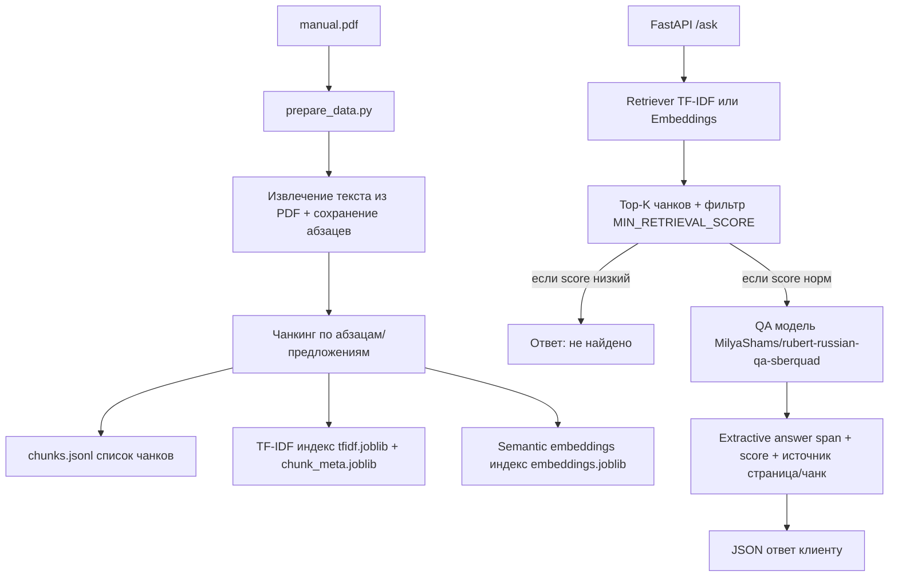

# BERT Project (PDF → Чанки → Поиск → Ответ)

## 1) Схема (pipeline)



---

## 2) Простое объяснение: что делает каждая часть

### Что такое чанки и зачем они нужны

PDF слишком большой, чтобы нейросеть могла "прочитать" его целиком за один раз.  
У моделей есть ограничение на длину входного текста.

Поэтому текст документа режется на маленькие куски — **чанки**.

Зачем это нужно:
- легче искать нужный фрагмент
- быстрее работать
- выше шанс, что ответ полностью находится внутри одного куска текста

---

### Retriever (поиск по чанкам)

Retriever — это "поисковик по документации".  
Он отвечает на вопрос:

> **Где в документе может быть ответ?**

Есть два варианта:

#### 1️⃣ TF-IDF
- Ищет совпадения по словам
- Очень быстрый
- Плохо работает с перефразами  
  (например, "меры безопасности" ≠ "правила безопасности")

#### 2️⃣ Embeddings
- Ищет совпадения по смыслу
- Лучше понимает переформулировки
- Требует предварительной подготовки (вычисление эмбеддингов)

---

### QA модель (читатель)

`MilyaShams/rubert-russian-qa-sberquad` — это модель **extractive QA**.

Она:
- не придумывает ответ
- не пересказывает текст
- **вырезает кусок текста (span)** из выбранного чанка

То есть она выбирает конкретную фразу из документа.

---

### Итого как работает система

1. **Retriever** находит подходящие чанки  
2. **QA модель** вырезает точный ответ из лучшего чанка  

Это называется схема:  
**Retrieve → Read**

---

## 3) Установка и запуск на Windows (пошагово)

### 3.1 Открыть PowerShell и перейти в папку проекта
```powershell
cd C:\Users\Alex\Desktop\bert_project
```

### 3.2 Создать виртуальное окружение (venv)

Виртуальное окружение — это "изолированная папка с библиотеками", чтобы не ломать Python в системе и не смешивать зависимости разных проектов.

```powershell
python -m venv .venv
```

После этого появится папка `.venv`.

### 3.3 Активировать окружение

**(важная строка)**
```powershell
.\.venv\Scripts\Activate.ps1
```

После активации в терминале появится **(.venv)** — это значит окружение включено.

### 3.4 Если PowerShell ругается на политику выполнения скриптов

Разреши запуск скриптов временно (только для текущего окна):

```powershell
Set-ExecutionPolicy -Scope Process -ExecutionPolicy Bypass
```

И снова активируй окружение:

```powershell
.\.venv\Scripts\Activate.ps1
```

### 3.5 Установить зависимости

Если есть `requirements.txt`:

```powershell
pip install -r requirements.txt
```

Если `requirements.txt` нет — минимально:

```powershell
pip install fastapi uvicorn pydantic joblib scikit-learn pymupdf transformers torch numpy
```

⚠️ **На некоторых ПК torch ставится отдельно.** Если возникают ошибки, ставь CPU-версию:

```powershell
pip install torch --index-url https://download.pytorch.org/whl/cpu
```

---

## 4) Подготовка данных (обязательный шаг)

Перед запуском сервера нужно собрать индексы:
- чанки
- TF-IDF
- embeddings

Запуск:

```powershell
python prepare_data.py
```

После выполнения в папке **data/** должны появиться файлы:
- `chunks.jsonl`
- `tfidf.joblib`
- `chunk_meta.joblib`
- `embeddings.joblib`

Если этих файлов нет — сервер не сможет искать ответы.

---

## 5) Запуск API сервера

### 5.1 (Опционально) задать токен HF

**(важная строка)**
```powershell
$env:HF_TOKEN="your HF token here"
```

Если модель публичная — токен обычно не нужен.  
Если модель gated — без токена загрузка не сработает.

### 5.2 Запуск сервера

**(важная строка)**
```powershell
uvicorn app.main:app --reload
```

### 5.3 Открыть Swagger UI

**(важная строка)**
```
http://127.0.0.1:8000/docs#
```

Там можно отправлять запросы к API.

---

## 6) Пример запроса в /ask

В Swagger (/docs) выбери **POST /ask** и отправь:

```json
{
  "question": "как соблюдать правила безопасности?"
}
```

Система:
- найдёт подходящий чанк
- прогонит QA модель
- вернёт ответ + страницу документа

---

## Быстрый чек-лист (на всякий случай)

```powershell
# 1. Создать окружение
python -m venv .venv

# 2. Активировать .venv
.\.venv\Scripts\Activate.ps1

# 3. Установить зависимости
pip install -r requirements.txt

# 4. Подготовить данные
python prepare_data.py

# 5. Запустить сервер
uvicorn app.main:app --reload

# 6. Открыть в браузере
http://127.0.0.1:8000/docs#
```

---

